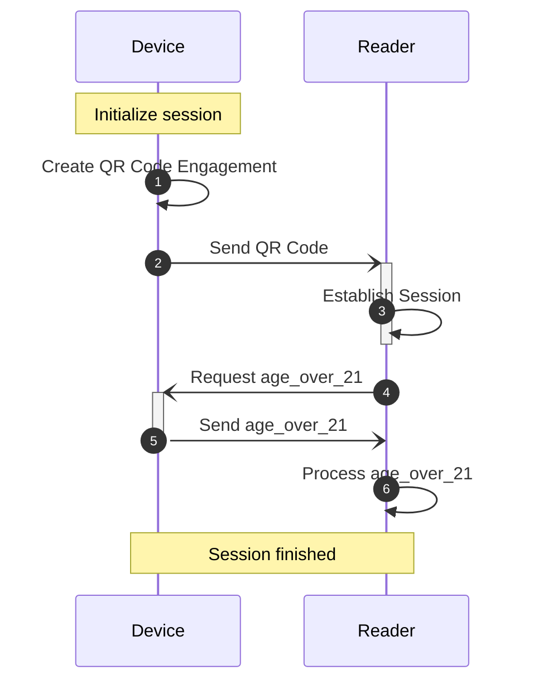

# isomdl

ISO/IEC DIS 18013-5 mDL implementation in Rust.

## CLI tool

This crate contains a CLI tool. Run the `--help` command to see what actions you can perform.

```bash
cargo run -- --help
```

For example, you can get the namespaces and elements defined in an mDL:

```bash
cat test/stringified-mdl.txt | cargo run -- get-namespaces -
```

## Library

Here are some examples of how to use the library.

### Simulated device and reader interaction

This example demonstrates a simulated device and reader interaction.  
The reader requests the `age_over_21` element, and the device responds with that value.



### The flow of the interaction

1. **Device initialization and engagement:**
    - The device creates a QR code containing `DeviceEngagement` data, which includes its public key.
    - Internally:
        - The device initializes with the mDL data, private key, and public key.
2. **Reader processing QR and requesting needed fields:**
    - The reader processes the QR code and creates a request for the `age_over_21` element.
    - Internally:
        - Generates its private and public keys.
        - Initiates a key exchange, and generates the session keys.
        - The request is encrypted with the reader's session key.
3. **Device accepting request and responding:**
    - The device receives the request and creates a response with the `age_over_21` element.
    - Internally:
        - Initiates the key exchange, and generates the session keys.
        - Decrypts the request with the reader's session key.
        - Parse and validate it creating error response if needed.
        - The response is encrypted with the device's session key.
4. **Reader Processing mDL data:**
    - The reader processes the response and prints the value of the `age_over_21` element.

#### Device perspective

The reader is simulated in `common` module (you can find the code in `examples`), and we focus on the code from the
device perspective.

<!-- INCLUDE-RUST: examples/on_simulated_device.rs -->

```rust
use anyhow::{anyhow, Context, Result};
use signature::{SignatureEncoding, Signer};
use uuid::Uuid;

use isomdl::definitions;
use isomdl::definitions::device_engagement::{CentralClientMode, DeviceRetrievalMethods};
use isomdl::definitions::device_request::DocType;
use isomdl::definitions::helpers::NonEmptyMap;
use isomdl::definitions::{BleOptions, DeviceRetrievalMethod};
use isomdl::presentation::device::{Document, Documents, RequestedItems, SessionManagerEngaged};
use isomdl::presentation::{device, Stringify};

use crate::common::{establish_reader_session, reader_handle_device_response};

mod common;

const DOC_TYPE: &str = "org.iso.18013.5.1.mDL";
const NAMESPACE: &str = "org.iso.18013.5.1";
const AGE_OVER_21_ELEMENT: &str = "age_over_21";

fn main() -> Result<()> {
    // Device initialization and engagement
    let (engaged_state, qr_code_uri) = initialise_session()?;

    // Reader processing QR and requesting needed fields
    let (mut reader_session_manager, request) = establish_reader_session(qr_code_uri)?;

    // Device accepting request
    let (device_session_manager, requested_items) = handle_request(engaged_state, request)?;

    // Prepare response with required elements
    let response = create_response(
        device_session_manager,
        requested_items,
        &create_signing_key()?,
    )?;

    // Reader Processing mDL data
    reader_handle_device_response(&mut reader_session_manager, response)?;

    Ok(())
}

/// Parse the mDL encoded string into a [Documents] object.
fn parse_mdl() -> Result<NonEmptyMap<DocType, Document>> {
    let mdl_encoded = include_str!("../examples/data/stringified-mdl.txt");
    let mdl = Document::parse(mdl_encoded.to_string()).context("could not parse mDL")?;
    let docs = Documents::new(DOC_TYPE.to_string(), mdl);
    Ok(docs)
}

/// Creates a QR code containing `DeviceEngagement` data, which includes its public key.
fn initialise_session() -> Result<(SessionManagerEngaged, String)> {
    // Parse the mDL
    let docs = parse_mdl()?;

    let drms = DeviceRetrievalMethods::new(DeviceRetrievalMethod::BLE(BleOptions {
        peripheral_server_mode: None,
        central_client_mode: Some(CentralClientMode {
            uuid: Uuid::new_v4(),
        }),
    }));

    let session = device::SessionManagerInit::initialise(docs, Some(drms), None)
        .context("failed to initialize device")?;

    session
        .qr_engagement()
        .context("could not generate qr engagement")
}

/// The Device handles the request from the reader and advances the state.
fn handle_request(
    state: SessionManagerEngaged,
    request: Vec<u8>,
) -> Result<(device::SessionManager, RequestedItems)> {
    let (session_manager, items_requests) = {
        let session_establishment: definitions::SessionEstablishment =
            serde_cbor::from_slice(&request).context("could not deserialize request")?;
        state
            .process_session_establishment(session_establishment)
            .context("could not process process session establishment")?
    };
    if session_manager.get_next_signature_payload().is_some() {
        anyhow::bail!("there were errors processing request");
    }
    Ok((session_manager, items_requests))
}

/// Prepare response with required elements.
fn create_response(
    mut session_manager: device::SessionManager,
    requested_items: RequestedItems,
    key: &p256::ecdsa::SigningKey,
) -> Result<Vec<u8>> {
    let permitted_items = [(
        DOC_TYPE.to_string(),
        [(NAMESPACE.to_string(), vec![AGE_OVER_21_ELEMENT.to_string()])]
            .into_iter()
            .collect(),
    )]
    .into_iter()
    .collect();
    session_manager.prepare_response(&requested_items, permitted_items);
    let (_, sign_payload) = session_manager.get_next_signature_payload().unwrap();
    let signature: p256::ecdsa::Signature = key.sign(sign_payload);
    session_manager
        .submit_next_signature(signature.to_der().to_vec())
        .context("failed to submit signature")?;
    session_manager
        .retrieve_response()
        .ok_or(anyhow!("cannot prepare response"))
}

fn create_signing_key() -> Result<p256::ecdsa::SigningKey> {
    Ok(p256::SecretKey::from_sec1_pem(include_str!("../examples/data/sec1.pem"))?.into())
}
```

#### Reader perspective

Now the device is simulated in `common` module (you can find the code in `examples`), and we focus on the code from the
reader perspective. The code is
considerably shorter.

<!-- INCLUDE-RUST: examples/on_simulated_reader.rs -->

```rust
use anyhow::{Context, Result};

use isomdl::definitions::device_request::{DataElements, Namespaces};
use isomdl::presentation::reader;

use crate::common::{create_response, create_signing_key, handle_request, initialise_session};

mod common;

const DOC_TYPE: &str = "org.iso.18013.5.1.mDL";
const NAMESPACE: &str = "org.iso.18013.5.1";
const AGE_OVER_21_ELEMENT: &str = "age_over_21";

fn main() -> Result<()> {
    // Device initialization and engagement
    let (engaged_state, qr_code_uri) = initialise_session()?;

    // Reader processing QR and requesting needed fields
    let (mut reader_session_manager, request) = establish_reader_session(qr_code_uri)?;

    // Device accepting request
    let (device_session_manager, requested_items) = handle_request(engaged_state, request)?;

    // Prepare response with required elements
    let response = create_response(
        device_session_manager,
        requested_items,
        &create_signing_key()?,
    )?;

    // Reader Processing mDL data
    reader_handle_device_response(&mut reader_session_manager, response)?;

    Ok(())
}

/// Establishes the reader session from the given QR code and create request for needed elements.
fn establish_reader_session(qr: String) -> Result<(reader::SessionManager, Vec<u8>)> {
    let requested_elements = Namespaces::new(
        NAMESPACE.into(),
        DataElements::new(AGE_OVER_21_ELEMENT.to_string(), false),
    );
    let (reader_sm, session_request, _ble_ident) =
        reader::SessionManager::establish_session(qr, requested_elements)
            .context("failed to establish reader session")?;
    Ok((reader_sm, session_request))
}

/// Reader Processing mDL data.
fn reader_handle_device_response(
    reader_sm: &mut reader::SessionManager,
    response: Vec<u8>,
) -> Result<()> {
    let res = reader_sm.handle_response(&response)?;
    println!("{:?}", res);
    Ok(())
}
```
