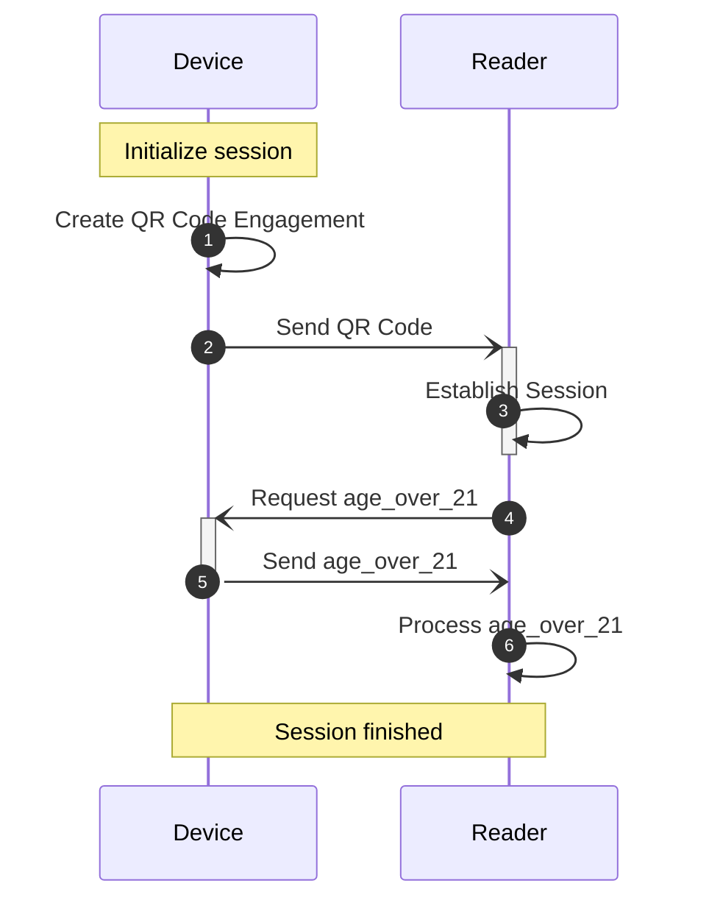
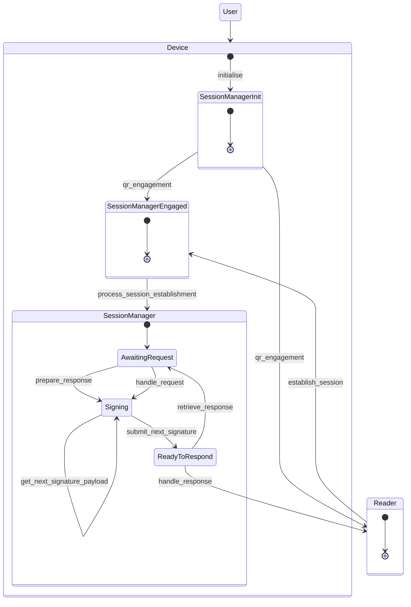
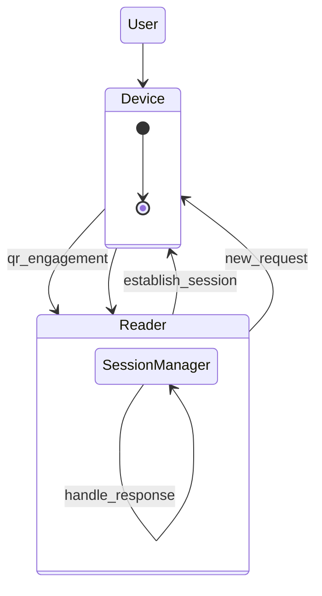

# isomdl

[ISO/IEC DIS 18013-5](https://mobiledl-e5018.web.app/ISO_18013-5_E_draft.pdf) **mDL** implementation in Rust.

It is intended to be used in creating apps for **Devices** and **Readers** that can interact with each other to
exchange **mDL**

## CLI tool

This crate contains a CLI tool. Run the `--help` command to see what actions you can perform.

```bash
cargo run -- --help
```

For example, you can get the namespaces and elements defined in an mDL:

```bash
cat test/stringified-mdl.txt | cargo run -- get-namespaces -
```

## Library

You can see more examples on how to use the library in [examples](examples) directory and read about in the
dedicated [README](examples/README.md).

### **Device** and **Reader** interaction

This flow demonstrates a simulated device and reader interaction.  
The reader requests the `age_over_21` element, and the device responds with that value.



#### The flow of the interaction

1. **Device initialization and engagement:**
    - The device creates a **QR code** containing `DeviceEngagement` data, which includes its public key.
    - Internally:
        - The device initializes with the **mDL** data, private key, and public key.
2. **Reader processing QR code and requesting needed fields:**
    - The reader processes the **QR code** and creates a request for the `age_over_21` element.
    - Internally:
        - Generates its private and public keys.
        - Initiates a key exchange, and generates the session keys.
        - The request is encrypted with the reader's session key.
3. **Device accepting request and responding:**
    - The device receives the request and creates a response with the `age_over_21` element.
    - Internally:
        - Initiates the key exchange, and generates the session keys.
        - Decrypts the request with the reader's session key.
        - Parse and validate it creating error response if needed.
        - The response is encrypted with the device's session key.
4. **Reader Processing mDL data:**
    - The reader processes the response and prints the value of the `age_over_21` element.

##### Examples

You can see the example in [simulated_device_and_reader](examples/simulated_device_and_reader.rs) or a version that
uses **State pattern**, `Arc`
and `Mutex` in [simulated_device_and_reader_state](examples/simulated_device_and_reader_state.rs).

#### Device perspective

There are several states through which the device goes during the interaction:



##### Examples

You can see the full example in [on_simulated_device](examples/on_simulated_device.rs).  
The reader is simulated in [common](examples/common.rs) module (you can find the code in [examples](examples)),
and we focus on the code from the
device perspective.

#### Reader perspective

From the reader's perspective, the flow is simpler:



##### Examples

You can see the full example in [on_simulated_reader](examples/on_simulated_reader.rs).
The code is considerably shorter.  
Now the reader is simulated in [common](examples/common.rs) module (you can find the code in [examples](examples)),
and we focus on the code from the reader's perspective.
