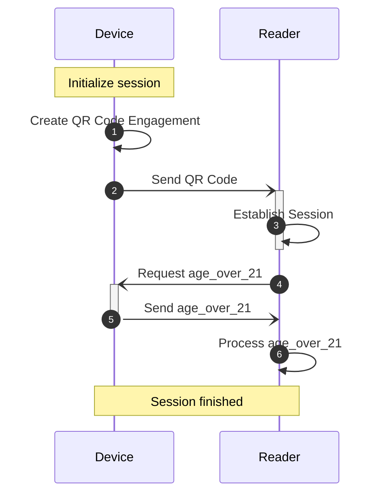

# isomdl examples

Collection of examples of how you can use the library.

# Simulated device and reader interaction

This example demonstrates a simulated device and reader interaction.  
The reader requests the `age_over_21` element, and the device responds with that value.

## The flow of the interaction

1. **Device initialization and engagement:**
    - The device creates a QR code containing `DeviceEngagement` data, which includes its public key.
    - Internally:
        - The device initializes with the mDL data, private key, and public key.
2. **Reader processing QR and requesting needed fields:**
    - The reader processes the QR code and creates a request for the `age_over_21` element.
    - Internally:
        - Generates its private and public keys.
        - Initiates a key exchange, and generates the session keys.
        - The request is encrypted with the reader's session key.
3. **Device accepting request and responding:**
    - The device receives the request and creates a response with the `age_over_21` element.
    - Internally:
        - Initiates the key exchange, and generates the session keys.
        - Decrypts the request with the reader's session key.
        - Parse and validate it creating error response if needed.
        - The response is encrypted with the device's session key.
4. **Reader Processing mDL data:**
    - The reader processes the response and prints the value of the `age_over_21` element.

There are several examples:

- full flow of the interaction:
    - in a basic structure [simulated_device_and_reader_basic](simulated_device_and_reader_basic.rs)
    - more organized structure using `State` pattern, `Arc`
      and `Mutex` [simulated_device_and_reader_structured](simulated_device_and_reader_structured.rs)
- on the device perspective [on_simulated_device](on_simulated_device.rs)
- on the reader perspective [on_simulated_reader](on_simulated_reader.rs)
